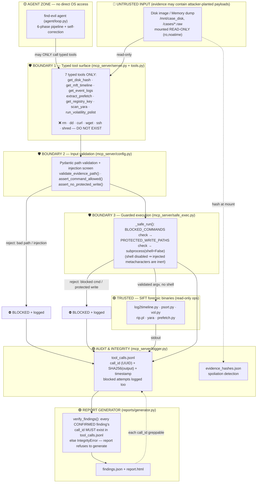

# Find Evil! — Architecture & Security Boundaries

This document is the architecture-diagram submission. It shows the data flow,
the components, and — most importantly for the judging criteria — the **trust
boundaries** where the architectural guarantees are enforced.

The central design claim: **the agent cannot tamper with evidence or exfiltrate
data because the capability to do so does not exist in its tool surface**, not
because it was told not to. Every boundary below is enforced in code, before any
subprocess spawns, and is covered by tests.

---

## System diagram (Mermaid — renders on GitHub)



---

## Trust boundaries — what each one stops

| Boundary | Enforced in | Stops | Test |
|---|---|---|---|
| **1. Typed tool surface** | `tools.py`, `server.py` | The agent ever invoking `rm`/`dd`/`curl`/`ssh` — they are not registered tools | `test_full_pipeline.py` |
| **2. Input validation** | `config.py::validate_evidence_path`, `assert_command_allowed` | Path injection (`&&`, backticks), paths outside `/cases`,`/mnt`, traversal | `test_guardrails.py` (path cases) |
| **3. Guarded execution** | `safe_exec.py::_safe_run` + `config.py` | Blocked commands, writes to protected paths; `shell=False` neutralizes any injected metacharacters | `test_guardrails.py` (command + write cases) |
| **Audit & integrity** | `logger.py` | Untraceable actions — every call (executed *or* blocked) is logged with a SHA256 | `test_logger.py` |
| **Report integrity** | `generator.py::verify_findings` | Hallucinated CONFIRMED findings — no `call_id` in the log ⇒ report aborts | `test_report_integrity.py` |

---

## Layered view (ASCII fallback)

```
┌──────────────────────────────────────────────────────────────────────────┐
│ LAYER 6 · INTERFACE        find-evil CLI  (agent/loop.py)                  │
├──────────────────────────────────────────────────────────────────────────┤
│ LAYER 5 · ORCHESTRATION    6-phase loop · self-correction · correlation    │
│                            Triage→Timeline→Memory→Artifacts→Correlate→Report│
├───────────────────────── 🛡️ TRUST BOUNDARY (agent ↔ OS) ──────────────────┤
│ LAYER 4 · TYPED TOOLS      mcp_server: 7 forensic tools, rm/dd/curl ABSENT  │
│ LAYER 3 · VALIDATION       Pydantic paths + injection screen (config.py)    │
│ LAYER 2 · GUARDED EXEC     _safe_run: BLOCKED_COMMANDS + PROTECTED paths     │
│                            subprocess(shell=False)  (safe_exec.py)           │
├──────────────────────────────────────────────────────────────────────────┤
│ LAYER 1 · TRUSTED TOOLS    SIFT binaries (read-only): log2timeline, vol...   │
├──────────────────────────────────────────────────────────────────────────┤
│ CROSS-CUTTING · AUDIT      tool_calls.jsonl (call_id + SHA256) · report     │
│                            generator verifies every CONFIRMED call_id        │
└──────────────────────────────────────────────────────────────────────────┘
        Evidence (/mnt, /cases) mounted READ-ONLY — writes rejected at L1, L2, L3
```

---

## Defense-in-depth: a single injection attempt, traced

Attacker plants `parsers = "mft; rm /cases/evidence.E01"` (via a tool argument):

1. **Boundary 2** — `_screen_aux_field` rejects the `;` character → `GuardrailError`.
2. *Even if it passed*, **Boundary 3** — `_safe_run` finds `rm` in `BLOCKED_COMMANDS` → rejected.
3. *Even if that passed*, the call runs with `shell=False`, so `; rm …` is a literal
   string argument to `log2timeline.py`, never a second command.
4. The blocked attempt is written to `tool_calls.jsonl` as `BLOCKED_ATTEMPT`.

Three independent layers, any one of which stops it. This is the "architectural,
not prompt-based" property the hackathon asks teams to demonstrate.

> To export a PNG for slides: paste the Mermaid block into https://mermaid.live
> and export, or run `mmdc -i ARCHITECTURE.md -o architecture.png` (mermaid-cli).
