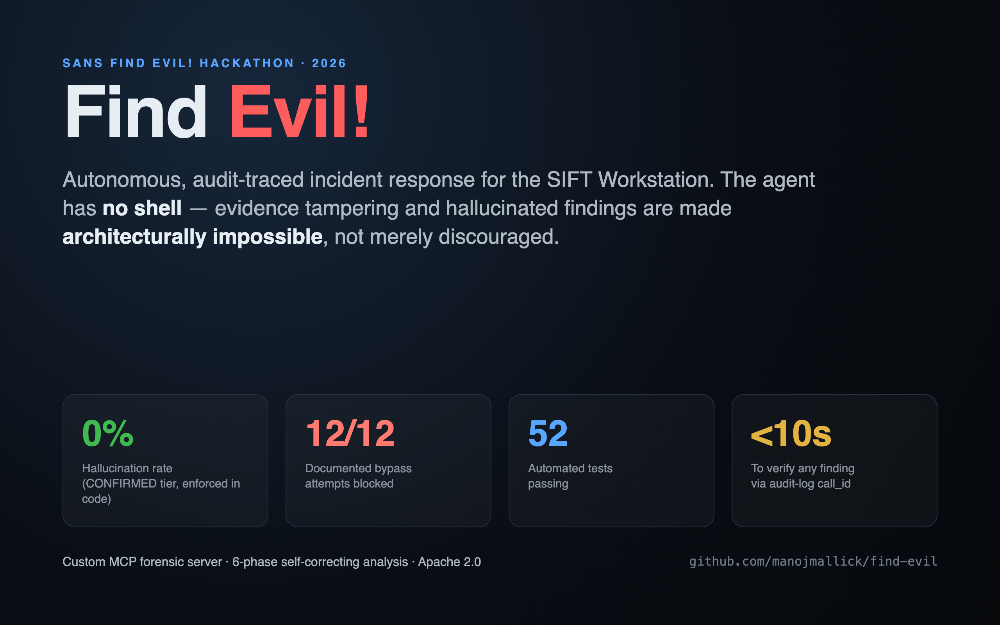

# Find Evil! 🔍



**Autonomous, audit-traced incident response for the SANS SIFT Workstation.**

> AI-powered adversaries operate in minutes; human responders are still pulling
> up their toolkit. Find Evil! is an autonomous IR agent that analyzes disk and
> memory evidence the way a senior analyst does — sequencing tools, recognizing
> anomalies, and self-correcting — while making **evidence tampering and
> hallucinated findings architecturally impossible**, not merely discouraged.

Built for the **SANS Find Evil! Hackathon 2026**. Apache 2.0.

---

## Why this is different

Most "AI for DFIR" demos give a model a shell and a polite instruction not to
break things. Find Evil! removes the shell. The agent reaches the OS **only**
through a custom MCP server exposing typed forensic tools — `rm`, `dd`, `curl`,
`ssh` do not exist in its world.

| Property | How it's guaranteed | Proof |
|---|---|---|
| **Evidence can't be tampered** | `rm`/`dd`/`shred`/redirects to `/cases`,`/mnt` rejected in code before any subprocess spawns | `tests/unit/test_guardrails.py` (30 tests), `BYPASS_TESTING.md` (12/12) |
| **No exfiltration** | `curl`/`wget`/`ssh`/`scp`/`nc` not in the tool surface; blocked at `_safe_run` | same |
| **0% hallucination (CONFIRMED tier)** | every CONFIRMED finding must carry a `call_id` present in the audit log, or the report refuses to generate | `tests/unit/test_report_integrity.py`, `ACCURACY_REPORT.md` |
| **Full chain of custody** | every tool call → UUID `call_id` + SHA256 of output in `tool_calls.jsonl`; any finding greps back in <10s | `DEMO_VIDEO_SCRIPT.md` Shot 6 |

These map directly to the hackathon's judging criteria: **Constraint
Implementation (architectural vs prompt-based)** and **Audit Trail Quality**.

---

## Architecture (30-second version)

```
Agent (6-phase loop)  ──calls──►  MCP server (typed tools only)  ──guarded──►  SIFT binaries
   │                                  │  rm/dd/curl DO NOT EXIST here          (log2timeline, vol, ...)
   │                                  ▼
   └──────────────────────────►  Audit log (tool_calls.jsonl: call_id + SHA256)
                                      │
   Report generator  ◄──verifies every CONFIRMED call_id against the log──┘
```

Full diagram with trust boundaries: **[ARCHITECTURE.md](ARCHITECTURE.md)**.

---

## Quick start (SIFT Workstation, Ubuntu 22.04)

```bash
# One-command install (clones, venv, deps, YARA rules, directories, shell wrapper)
curl -fsSL https://raw.githubusercontent.com/manojmallick/find-evil/main/install.sh | bash
```

Or from source:

```bash
git clone https://github.com/manojmallick/find-evil.git
cd find-evil
python3 -m venv .venv && source .venv/bin/activate
pip install -e ".[dev]"
```

### Run an analysis

```bash
# 1. Mount evidence read-only
sudo ewfmount /path/to/evidence.E01 /mnt/ewf/
sudo mount -o ro,loop,noatime /mnt/ewf/ewf1 /mnt/case_disk

# 2. Create a case
mkdir -p /cases/CASE001
cp /cases/TEMPLATE/CLAUDE.md /cases/CASE001/

# 3. Analyze (disk + memory)
find-evil --case /cases/CASE001 --disk /mnt/case_disk \
          --memory /cases/CASE001/memory.raw --max-iterations 3

# 4. View + verify
python3 -m json.tool /cases/CASE001/findings/findings.json
firefox /cases/CASE001/findings/report.html
grep '<call_id from report>' /opt/find-evil/logs/tool_calls.jsonl | python3 -m json.tool
```

---

## Two execution modes

**Deterministic pipeline (default)** — a fixed, reproducible 6-phase sequence.
Court-defensible: the same case always runs the same way.

**Autonomous reasoning (`--reasoning`)** — a Claude model drives the
investigation: it chooses the next tool based on what it finds, narrates its
analyst reasoning, forms and tests hypotheses, and self-corrects. **The
architectural guarantees still hold while the LLM is in control** — it can only
call the typed tools (no `rm`/`curl`), and a CONFIRMED finding it records is
rejected unless its `call_id` is in the audit log. Full autonomy, zero loss of
evidence integrity. Requires `ANTHROPIC_API_KEY`; falls back to deterministic.

```bash
find-evil --case /cases/CASE001 --disk /mnt/case_disk --reasoning   # autonomous
```

## The 6-phase analysis pipeline

1. **Triage** — chain-of-custody hash + YARA IOC sweep (20 custom rules)
2. **Timeline** — MFT + prefetch + **timestomping detection ($SI vs $FN)**
3. **Memory** — Volatility **pslist + malfind (injected code) + netscan**
4. **Artifacts** — registry persistence + logon event logs
5. **Correlation** — cross-source discrepancy detection + bounded self-correction
6. **Report** — verify every `call_id`, render `findings.json` + `report.html`

The self-correction loop is the demo's centerpiece: a process in the disk
prefetch timeline but absent from the memory process list is flagged, three
hypotheses are formed, and targeted re-analysis runs — autonomously.

**10 typed forensic tools**, covering disk, memory, registry, event logs, YARA,
anti-forensics (timestomping), and memory injection/network analysis.

---

## Verify the guarantees yourself (no SIFT needed)

```bash
python3 -m pytest tests/                                   # 56 passed
python3 tests/benchmark/run_benchmark.py --dataset synthetic   # precision/recall + 0% hallucination
```

- **56 tests** lock in the guardrails, the audit trail, and the hallucination guarantee.
- The **synthetic benchmark** runs anywhere and asserts 0% CONFIRMED-tier hallucination.

---

## Repository layout

```
mcp_server/      Custom MCP server — typed forensic tools + architectural guardrails
  config.py        BLOCKED_COMMANDS, PROTECTED_WRITE_PATHS, path/injection validation
  safe_exec.py     _safe_run() — the single guarded, shell=False chokepoint
  logger.py        Audit trail (tool_calls.jsonl) + SHA256 evidence integrity
  tools.py         10 typed forensic tools (rm/dd/curl deliberately absent)
  server.py        FastMCP registration layer
agent/loop.py    The `find-evil` command — 6-phase orchestrator + self-correction
  reasoning.py   Autonomous LLM mode (--reasoning) — Claude drives tool selection
reports/         Findings model + report generator (enforces call_id integrity)
tests/           56 unit/integration tests + reproducible benchmark harness
find_evil_custom.yar   20 custom YARA rules (lateral movement, persistence, C2, ...)
install.sh       One-command SIFT installer
```

---

## Documentation

| Doc | What |
|---|---|
| [ARCHITECTURE.md](ARCHITECTURE.md) | Layered architecture + security/trust boundaries |
| [BYPASS_TESTING.md](BYPASS_TESTING.md) | 12 documented bypass attempts, all blocked |
| [ACCURACY_REPORT.md](ACCURACY_REPORT.md) | Precision/recall, false positives, hallucination analysis |
| [DATASETS.md](DATASETS.md) | Test datasets + how ground truth is established |
| [DEMO_VIDEO_SCRIPT.md](DEMO_VIDEO_SCRIPT.md) | 5-minute demo shot list |
| [DEVPOST.md](DEVPOST.md) | Project description (Devpost submission text) |

---

## License

Apache 2.0 — see [LICENSE](LICENSE). Evidence integrity is the product.
